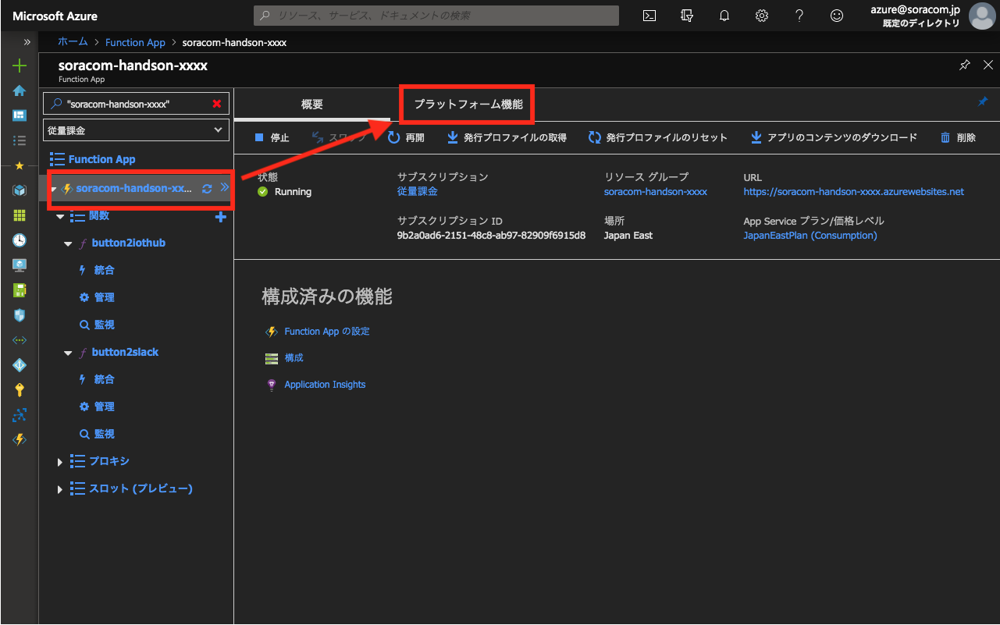
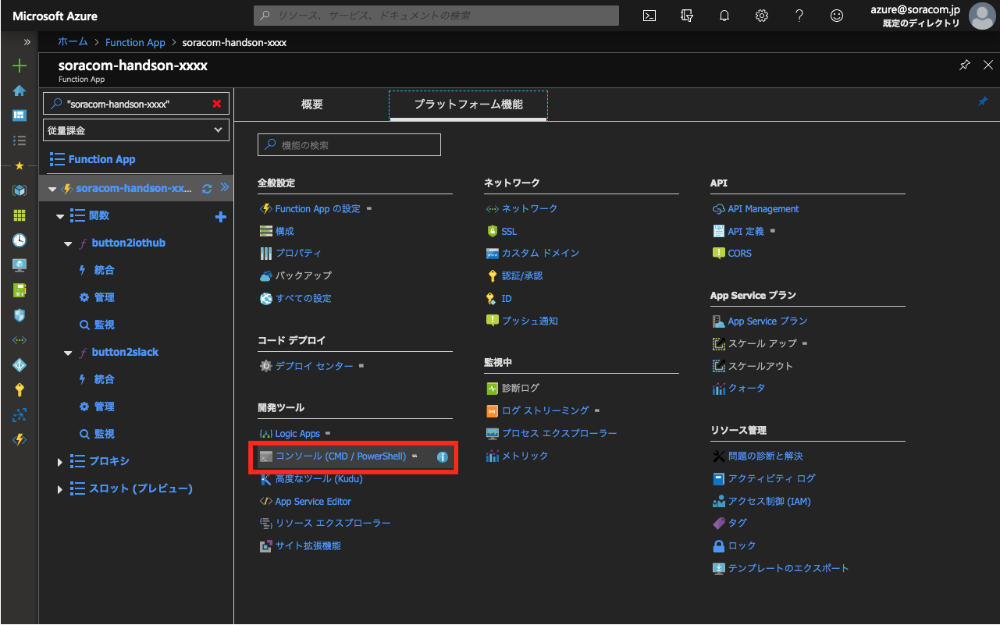
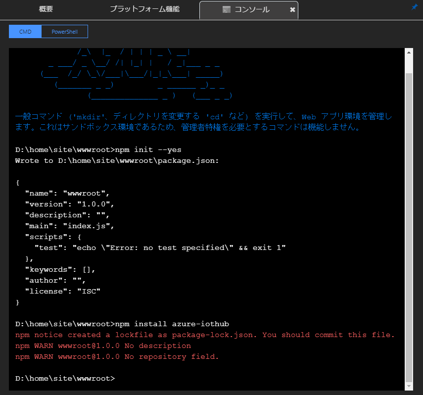
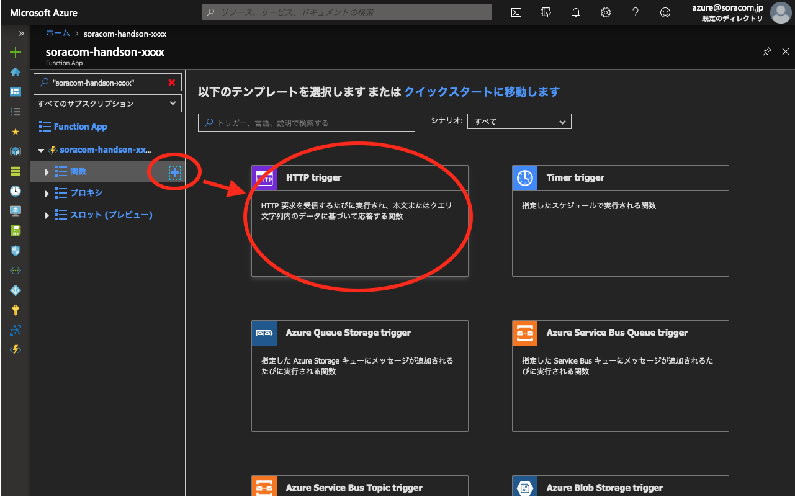
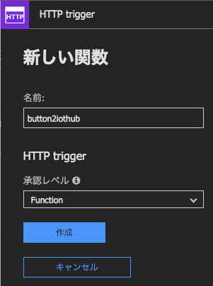
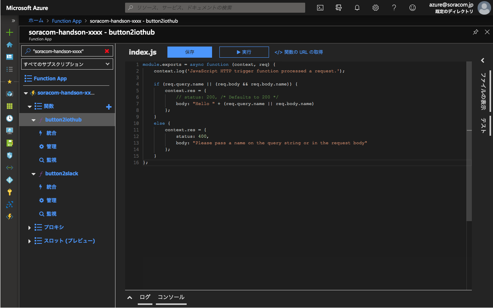

# C-1 Azure Functions で デバイス制御用 Function を作成
本ページでは、Azure Functions から Azure IoT Hub へ API 連携を行うための Function を作成します。

## Azure Portal で B-1 で作成済みの Function App を開く
もし閉じてしまっている場合には [https://portal.azure.com](https://portal.azure.com){:target="_blank"} にアクセスし、検索窓に function と入力し、 Function App を開きます。

## Azure IoT Hub ライブラリをインストールする
プログラムの実行に必要なライブラリをインストールします。

Function App を開いた状態で、上部の「プラットフォーム機能」をクリックします。

コンソールを開きます。

`npm install azure-iothub` とコマンド入力します。

しばらくするとコマンドが完了します。

> WARNING が出ますが、特に問題ありません。

## 関数を作成する
「関数」の右にある「＋」マークをクリックし、「HTTP trigger」をクリックします。

関数の名前を変更し（ `button2iothub` など）、作成を押すとしばらくして関数の作成が完了し、プログラムコードの編集画面となります。

下記のプログラムコードをコピーして貼り付け、１〜２行目を設定し、保存します

最後に、「</> 関数の URL の取得」をクリックし、「コピー」をクリックして、URL をどこかにメモしておきます。

## 以上で本ページの作業は完了となります