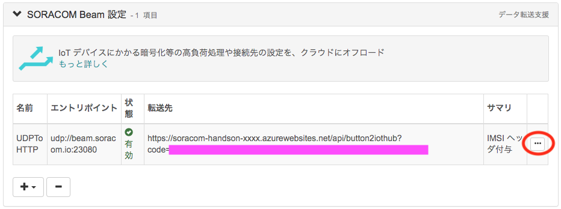
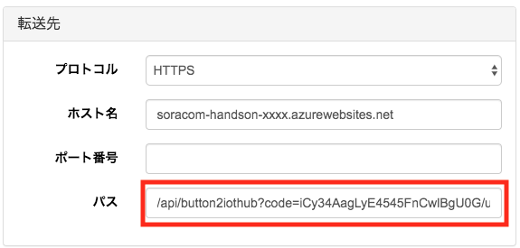
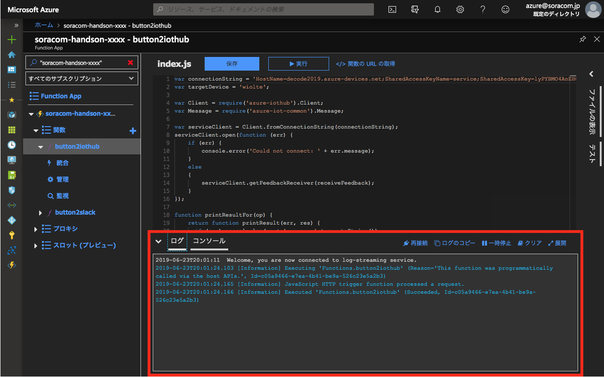

# C-2 SORACOM Beam から Function App を呼び出し、デバイスを制御する
本ページでは、ボタンを押した時に連携する Function を変更して、デバイスの制御を行えるようにします。
C-1 の最後にメモしておいた URL を使いますので、もしメモしていなかった場合は Azure Portal で確認してください。

## グループの設定
作業A で作成したグループを使用します。

SIM 管理画面でボタンの SIM のグループ名をクリックし、グループ詳細画面を開きます。
> または、SORACOM ユーザコンソール 左上の「≡ Menu」から `SORACOM Air for Cellular` ＞ `SIM グループ` を開き、ボタンに割り当てているグループ詳細画面を開きます。

### SORACOM Beam 設定
「SORACOM Beam 設定」を開き、B-2 で設定した設定を変更します。一番右の「...」ボタンを押します。

転送先設定の「パス」部分を、C-1 の最後に確認した URL の `/api/button2iothub` から後ろの部分に変更します

最後に一番下の「保存」を押して、設定変更が完了します。

## ボタンを押して Function App を呼び出し、デバイスが連動したかどうか確認する

ボタンを押して LED が緑色に光れば、呼び出し成功です。

デバイスが応答したかどうかを確認しましょう。

> シングルクリックで２秒間、ダブルクリックで４秒間、ロングクリックで５秒間、ファンが回ります。

また、Azure Portal の Function App のログを確認してみましょう。

## 以上で本ページの作業は完了となります