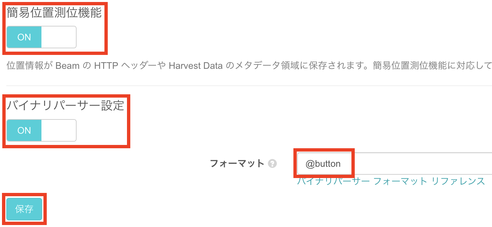
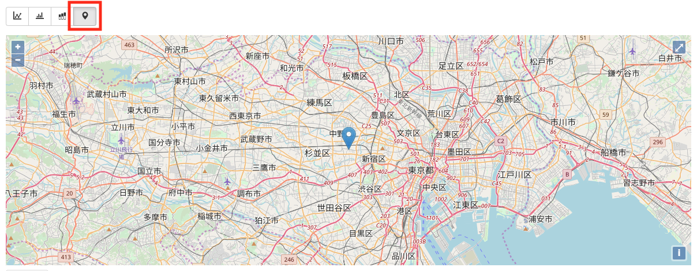

# A-2 Harvest を使ったボタンの動作確認

SORACOM Harvest を使って、ボタンが正常に動作しているか確認しましょう。

## SORACOM Harvest とは

SORACOM Harvest(以下、Harvest) は、IoTデバイスからのデータを収集、蓄積するサービスです。  
クラウドのセットアップをすることなく、 SORACOM アカウントのみでデータの可視化を素早く行っていただくことができます。

詳細は [SORACOM Harvest サービス紹介ページ](https://soracom.jp/services/harvest/) をご覧ください。

## グループの作成と割り当て、設定

まず [Air SIM 管理画面](https://console.soracom.io){:target="_blank"} を開いて、Enterprise ボタンの SIM にチェックマークを付けます。続いて、[操作] ボタンから [所属グループ変更] を選択します。

所属グループを選択するためのダイアログが表示されたら、[新しい所属グループ] ドロップダウンから [新しいグループを作成…] を選択します。

以下のようなグループ作成ダイアログが表示されます。グループの名称を入力して [グループ作成] ボタンをクリックします。 今回は `button` というグループ名で作成します。

[グループ作成] ボタンを押すと元の [SIM の所属グループ変更] ダイアログに戻ります。 [新しい所属グループ] ドロップボックスが、今作成した button グループになっていることを確認し [グループ変更] ボタンを押します。

先ほど作成した button グループに対し、バイナリパーサとSORACOM Harvest の設定を行います。SIM の[グループ列]にある[button]リンクをクリックします。

SIM グループの設定画面内にある [SORACOM Air for Cellular 設定] グループの下方にある [簡易位置測位機能] を ON に設定し、[バイナリパーサ設定]スイッチをONに設定し、[フォーマット]に `@button` と入力、保存ボタンをクリックします。

同じ SIM グループの設定画面内にある [SORACOM Harvest 設定] グループの中にあるスイッチをONに設定し、保存ボタンをクリックし、その後表示される [SORACOM Harvest が有効になっています]のダイアログが表示されたらOKボタンをクリックします。

### NOTE: バイナリパーサーとは

SIM グループの設定で行った **バイナリパーサー** とは、 バイナリデータを JSON データに変換する事を目的とした機能で、SORACOM Air for セルラー や LPWA通信である SORACOM Air for LoRaWAN / Sigfox でご利用いただくことができます。

JSON は構造化データであり、また、テキストであるため汎用性が高いことからクラウド連携によく用いられます。しかし、冗長な記述になることからデータサイズが大きくなりがちという面を持っています。  
一方、マイコンや LPWA のような狭帯域ネットワークにおいては、データサイズを小さくする目的からデータ処理や送受信にバイナリ形式を用いることがありますが、これはクラウド連携に向いていないという課題があります。

SORACOM Air バイナリパーサー機能は、このデバイス側、そしてクラウド側の双方の仲立ちをする機能で、マイコン処理の負担やネットワーク上のデータサイズを削減しつつクラウド連携を容易にできるため、さまざまな開発の工数や通信コストを下げることが可能となります。

バイナリパーサーはバイナリ列を解析するフォーマットを記述することで独自のフォーマットに対応いただくことができます。また SORACOM LTE-M Button においては `@button` という定義済みフォーマットが利用できます。

バイナリパーサー機能の詳しい解説やフォーマット記述方法については [バイナリパーサー詳細](https://dev.soracom.io/jp/docs/binary_parser/) をご覧ください。

## 送信データの確認

ボタンを一度クリックし、LEDインジケータがしばらくオレンジで点滅したあと緑に点灯することを確認します。最後に赤が点灯する場合は基地局との接続に失敗している可能性があるので、電波状況の良いところで再度試してください。

SORACOM ユーザーコンソールの左上 [Menu] > [SIM 管理] で表示される SIM の一覧から、Enterprise ボタンの SIM に **チェックマーク** を付けた後、 [操作]ボタン > [データを確認]をクリックします。

Harvest の グラフ表示を[集合棒グラフ]に切り替え、ボタンのクリックデータが表示されることを確認します。

※ この時、 [自動更新] を **ON** にしておくと、画面が自動的に更新されるので便利です。

プロットされるデータは以下の通りです。グラフの下にデータテーブルが表示されるので、どの様な形式でデータが出力されているのかも確認いただけます。

| 項目名 | 説明 | 値 |
|-------|------|----|
| clickType	| クリックの種類 | 1:シングルクリック / 2: ダブルクリック / 3: ロングクリック |
| batteryLevel | バッテリーレベル | 0.25 / 0.5 / 0.75 / 1.0 |

また、位置情報アイコンをクリックして表示を変更すると、LTE-M 通信に使用された基地局の情報を元にした位置情報が表示されます。

## 以上で本ページの作業は完了となります
