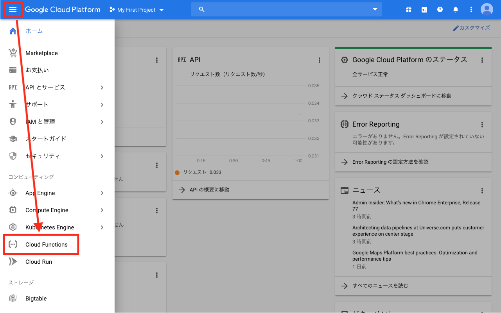
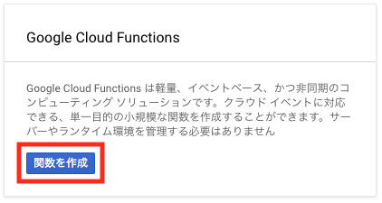
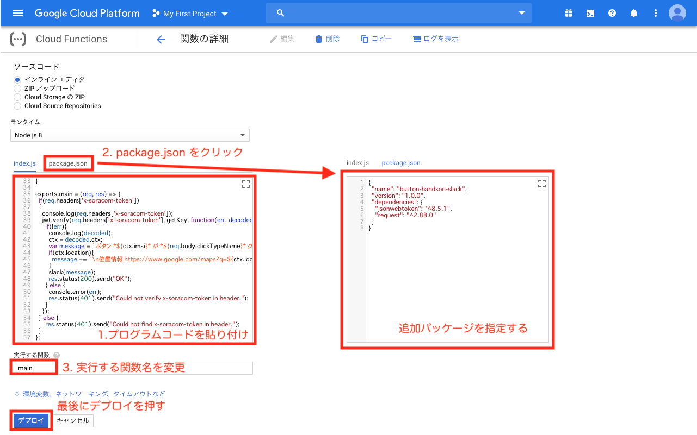
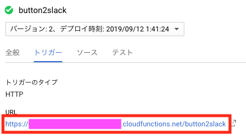

# B-1 Cloud Functions で Slack 通知用 Function(関数) を作成
本ページでは、Cloud Functions で Slack へ通知を行うための Function(関数) を作成します。

## Google Cloud Console へのサインイン
[https://console.cloud.google.com](https://console.cloud.google.com){:target="_blank"} にアクセスし、コンソールへログインします。

## 関数 を作成する
コンソール左上の「≡」をクリックしてメニューを開き、Cloud Functions を選びます。


Cloud Functions を初めて利用する場合は下記のような画面が表示されるので、「関数を作成」ボタンをクリックします。

> 既存の関数がある場合には、関数のリストが表示されます。その場合は、上部メニューの「＋関数を作成」をクリックします



以下のパラメータを変更し「作成」をクリックします。

- 名前: "button2slack" など、処理内容がわかりやすいもの

関数名をクリックします。しばらく待つと、関数名の前に ✅ マークが表示され、最初のデプロイが完了した事がわかります。

## 関数の編集
上部メニューから「編集」をクリックし、編集モードに入ります。

３つの作業が必要になります。 **必ず、すべて漏れのないように行ってください。**

### 1. プログラムコードの変更
下記のプログラムコードをコピーして index.js に貼り付けます。

<script src="https://gist.github.com/j3tm0t0/3aa3c164a9ca89a9f90b060154920d91.js"></script>

### 2. package.json の編集
「package.json」 をクリックし、以下の内容をコピーして、貼り付けます

```
{
  "name": "button-handson-slack",
  "version": "1.0.0",
  "dependencies": {
    "jsonwebtoken": "^8.5.1",
    "request": "^2.88.0"
  }
}
```

### 3. 実行する関数の変更
ソースコード下部の「実行する関数」を、`main` に変更します。

最後にデプロイを押します



## 関数トリガー URL の確認
「トリガー」をクリックし「URL」をメモ帳などにコピーしておきます。



## 以上で本ページの作業は完了となります

## 参考情報
プログラムコードの流れとしては、
1. SORACOM Funk から渡される「x-soracom-token」ヘッダの存在を確認（存在しない場合はエラー）
2. 存在する場合には JWT(JSON Web Token) として検証を行う (検証に失敗した場合はエラー))
3. 検証の結果、正しいトークンだと確認できた場合には、クリックされたイベントを Slack の　Incoming Webhook を利用して通知する

といった内容となっています。

自分の Slack Team へ通知を行いたい場合には、関数の編集中に最下部の「環境変数、ネットワーキング、タイムアウトなど」をクリックし、Webhook URL を設定します。


Webhook の作成方法については、Slack のドキュメントを参照してください
> [https://api.slack.com/incoming-webhooks](https://api.slack.com/incoming-webhooks){:target="_blank"}