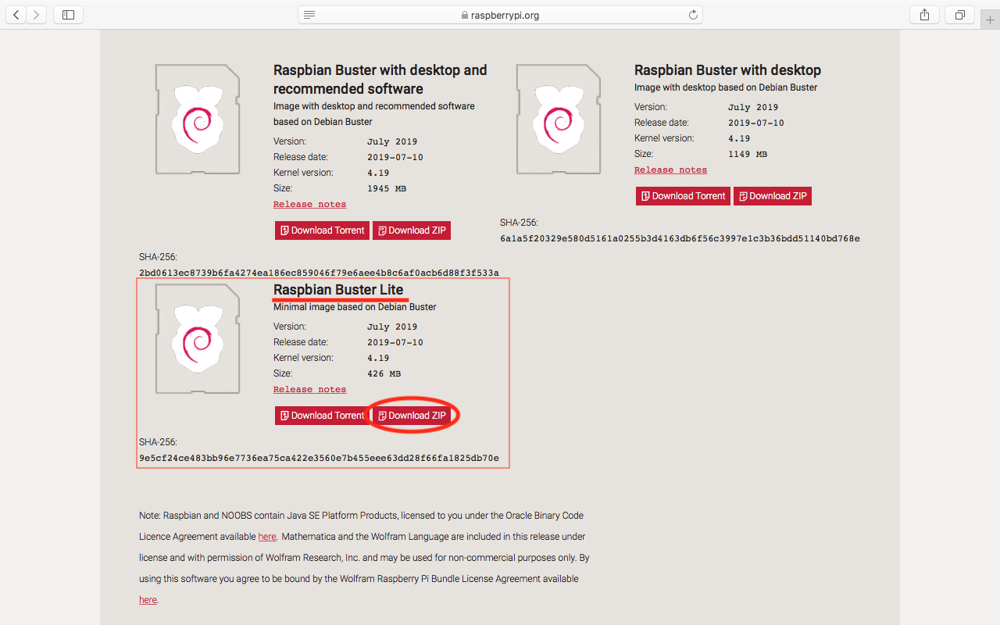
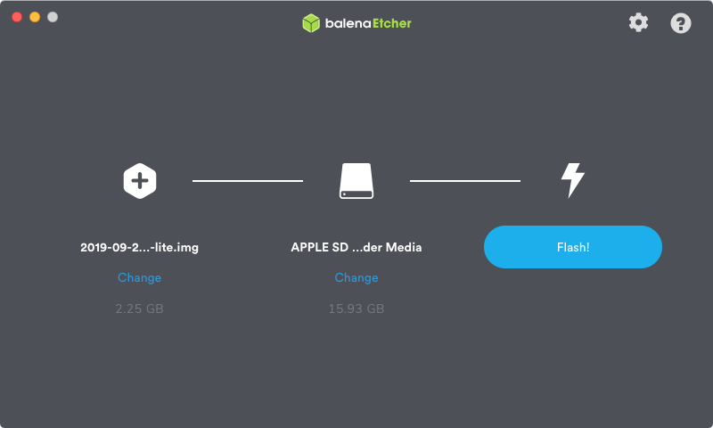
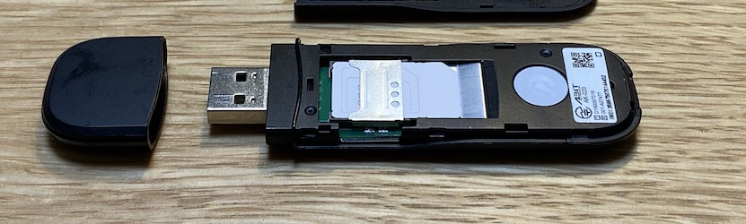

# Raspberry Pi の設定
本章では、Raspberry Pi の初期セットアップ方法と、USB モデムを使ったセルラー接続の設定方法について解説します。

## 用意するもの
以下のものを準備します。

### 必須
- Raspberry Pi 本体 (Raspberry Pi 3 Model B+ 等を想定)
- ACアダプター (5V2.4A ないしは 3A の出力のもの)
- Micro SD カード (4GB以上あれば十分だが、なるべく速度が速いものを推奨)
- PC (Windows/Mac/Linux など)
- Micro SD カードリーダー(USB接続や本体内蔵のもの)
- インターネット接続環境
    - 有線接続またはWiFi接続
- USB モデム (Abit AK-020など)
- SORACOM Air SIM (ユーザコンソールに登録済のもの)

### あると良いもの
- HDMI モニター (HDMI端子があれば、PC用モニターでもテレビでも可)
- キーボード (USB 有線接続または USB のアダプタ付きの無線接続のもの)
    - Bluetooth 接続の物は OS で設定するまで利用出来ないので注意

## <a name="INSTALL">OS(Raspbian) のインストール</a>
Raspberry Pi で標準的に使用されている、Raspbian を利用します。Raspbian は Linux ディストリビューションの１つ Debian GNU/Linux を、Raspberry Pi 向けに最適化したものとなります。また IoT 用途では Raspberry Pi にモニターやキーボード・マウスを接続して GUI 操作する事は稀であるため Lite イメージを使用します。  
Raspberry Pi 用の OS のインストールは、Micro SD カードに OS イメージを書き込む事で行います。これは通常はパソコンなどで行います。

### Raspbian イメージのダウンロード
Raspbian の OS イメージは、https://www.raspberrypi.org/downloads/raspbian/ からダウンロード出来ます。  
Raspbian Buster Lite のイメージを ZIP 形式でダウンロードします。



### Raspbian イメージを書き込む
SDカードへの書き込みには、balena 社の Ethcer(https://www.balena.io/etcher/) を使います。  
ご使用の環境に合わせたインストーラをダウンロードし、起動します。  

#### ＜重要＞起動したら、右上の歯車アイコンをクリックし `Auto-unmount on success` のチェックを外しておきます。


先ほどダウンロードしたZIP形式のファイルを選択し、書き込み先を指定して、Flash! を押すと書き込みを行います。



### SSH の有効化と WiFi の設定
まず　https://soracom-files.s3.amazonaws.com/raspbian_boot.zip から ZIP ファイルをダウンロードし、解凍してください。

この中には、２つのファイルがあります。

- `ssh` ファイル  
起動時に SSH を有効にするには `ssh` という空ファイルを SD カードの boot ボリュームにコピーする必要があります。

- `wpa_supplicant.conf` ファイル  
こちらは WiFi の設定ファイルとなります。`network={}` の中の `ssid/psk` を環境に合わせて変更してください。  

この２つのファイルを boot ボリュームにコピーします。


最後に SD カードを安全に取り外せるように、boot の横の ⏏ をクリックします(Windowsの場合には、タスクトレイから Disk の取り出しを行います)。

### Raspberry Pi の起動
#### SD カードを差し込む  


SD カードをしっかりと奥まで差し込みます。

#### HDMI や 有線 LAN ケーブルを接続する(オプション)
モニターを接続する場合や、無線 LAN を使わないで有線で接続するときには、電源をつなぐ前にケーブルを繋いでおきます。

#### 電源を入れる


最後に AC アダプターの Micro USB 端子を差し込みます。

赤い LED は常時点灯し、緑色の LED がチカチカと点滅すると思います。しばらくすると落ち着くと思うので、そうなれば起動完了です。

> 電源を切るには？  
> Raspberry Pi 上では Linux OS が動作しており、電源を落とす前には OS をシャットダウンする必要があります(強制的に終了した場合、OSが起動しなくなるなどする可能性があります)。  
> シャットダウンするには `sudo shutdown -h now` とコマンドを実行すると緑色の LED が激しく点滅し、しばらくすると消灯します。  
> この状態になったら、安全に電源を抜く事が出来ます。

## <a name="LOGIN">Raspberry Pi へのログイン</a>
以降は、Raspberry Pi に SSH でログインして各種コマンドを実行していきます。

> もし HDMI モニターとキーボードを用意できる場合には、直接操作を行っても構いません。

### Windows の場合
ターミナルソフト(Tera Term や Putty など)を使います。

#### TeraTerm の設定例
- ホスト名には `raspberrypi.local` を指定
- ユーザ名は `pi`
- パスフレーズは `raspberry`


#### トラブルシュート
> 「無効なホスト」と表示される

OS が最新の Windows 10 でない場合には `raspberrypi.local` という名前で接続ができない場合があります。  
その場合 Raspberry Pi を PC モニターや TV に HDMI 接続して IP アドレスを確認し、IP アドレスを指定して接続をしてください。

> 「接続が拒否されました」と表示される

SSH サービスが起動していません。SD カードの boot ボリュームに ssh ファイルをコピー出来ていなかった可能性が考えられます。  
もう一度イメージ書き込みからやり直すと良いでしょう。

### Mac/Linux の場合
macOS の「ターミナル」(アプリケーション→ユーティリティ→ターミナル)や Ubuntu の「端末」アプリケーションなどのターミナルソフトを起動し、以下のようなコマンドを実行します。

#### コマンド
```
ssh pi@raspberrypi.local
raspberry
```

#### 実行結果
```
~$ ssh pi@raspberrypi.local
Warning: Permanently added 'raspberrypi.local' (ECDSA) to the list of known hosts.
pi@raspberrypi.local's password: raspberry (画面には表示されません)
Linux raspberrypi 4.19.75-v7+ #1270 SMP Tue Sep 24 18:45:11 BST 2019 armv7l

The programs included with the Debian GNU/Linux system are free software;
the exact distribution terms for each program are described in the
individual files in /usr/share/doc/*/copyright.

Debian GNU/Linux comes with ABSOLUTELY NO WARRANTY, to the extent
permitted by applicable law.
Last login: Tue Oct 29 16:17:13 2019

SSH is enabled and the default password for the 'pi' user has not been changed.
This is a security risk - please login as the 'pi' user and type 'passwd' to set a new password.

pi@raspberrypi:~ $
```


上記のような画面となれば、Raspberry Pi への SSH ログインが出来たことになります。

#### トラブルシュート

> ssh: Could not resolve hostname raspberrypi.local: nodename nor servname provided, or not known

Raspberry Pi が正しく起動していないか、PC と異なるネットワークに接続されている可能性などが考えられます。  
HDMI モニターがある場合には画面上で IP アドレスを確認し、 `ssh pi@192.168.xxx.xxx` のように IP アドレスを指定してコマンドを実行してみましょう。

> ssh: connect to host raspberrypi.local port 22: Connection refused

SSH サービスが起動していません。SD カードの boot ボリュームに ssh ファイルをコピー出来ていなかった可能性が考えられます。  
もう一度イメージ書き込みからやり直すと良いでしょう。

### パスワード設定
初期パスワードのままでは、悪意のあるユーザに乗っ取られてしまう可能性があるので、必ずパスワードを変更しておきましょう。

#### コマンド
```
passwd
raspberry
新しいパスワード
```

#### 実行結果

```
pi@raspberrypi:~ $ passwd
Changing password for pi.
Current password: raspberry (画面には表示されません)
New password: 新しいパスワード
Retype new password: 新しいパスワード
passwd: password updated successfully
```

### ホスト名設定
もし複数の Raspberry Pi を使う予定がある場合は、ホスト名も変更しておくと良いでしょう。

`sudo raspi-config` コマンド -> 2. Network Options -> Hostname

### USB ドングルの準備
ユーザコンソールに登録済みの SORACOM Air SIM を USB ドングルに入れ、Raspberry Pi と接続します。

#### AK-020 の蓋を開ける


#### SIM を台紙から外す
一番外側を外して、標準サイズになるようにします


#### SIM をスロットに差し込む
いったん 平らなところに SIM を置き、押さえながら滑らせるようにしてスロットに入れます




#### USB スロット(任意)に AK-020 を差し込む


### 接続の設定を行う
Raspberry Pi 上で以下のようにコマンドを実行し、設定スクリプト(setup_air.sh) を実行します。

#### コマンド
```
curl https://soracom-files.s3.amazonaws.com/setup_air.sh | sudo bash
(しばらく待って)
ifconfig ppp0
```

#### 実行結果
```
pi@raspberrypi:~ $ curl -s https://soracom-files.s3.amazonaws.com/setup_air.sh | sudo bash
--- 1. Check required packages
wvdial is not installed! installing wvdial...

Get:1 http://archive.raspberrypi.org/debian buster InRelease [25.2 kB]
Get:2 http://raspbian.raspberrypi.org/raspbian buster InRelease [15.0 kB]
Get:3 http://archive.raspberrypi.org/debian buster/main armhf Packages [259 kB]
Get:4 http://raspbian.raspberrypi.org/raspbian buster/main armhf Packages [13.0 MB]
Fetched 13.3 MB in 48s (276 kB/s)
Reading package lists... Done
Reading package lists... Done
Building dependency tree
Reading state information... Done
The following additional packages will be installed:
  libpcap0.8 libuniconf4.6 libwvstreams4.6-base libwvstreams4.6-extras ppp
The following NEW packages will be installed:
  libpcap0.8 libuniconf4.6 libwvstreams4.6-base libwvstreams4.6-extras ppp wvdial
0 upgraded, 6 newly installed, 0 to remove and 35 not upgraded.
Need to get 1,178 kB of archives.
After this operation, 3,186 kB of additional disk space will be used.
Get:1 http://ftp.jaist.ac.jp/pub/Linux/raspbian-archive/raspbian buster/main armhf libpcap0.8 armhf 1.8.1-6 [124 kB]
Get:2 http://ftp.jaist.ac.jp/pub/Linux/raspbian-archive/raspbian buster/main armhf libwvstreams4.6-base armhf 4.6.1-14 [191 kB]
Get:3 http://ftp.jaist.ac.jp/pub/Linux/raspbian-archive/raspbian buster/main armhf libwvstreams4.6-extras armhf 4.6.1-14 [325 kB]
Get:4 http://ftp.jaist.ac.jp/pub/Linux/raspbian-archive/raspbian buster/main armhf libuniconf4.6 armhf 4.6.1-14 [139 kB]
Get:6 http://ftp.jaist.ac.jp/pub/Linux/raspbian-archive/raspbian buster/main armhf wvdial armhf 1.61-5 [86.6 kB]
Get:5 http://ftp.tsukuba.wide.ad.jp/Linux/raspbian/raspbian buster/main armhf ppp armhf 2.4.7-2+4.1 [312 kB]
Fetched 1,178 kB in 34s (35.1 kB/s)
Preconfiguring packages ...
Selecting previously unselected package libpcap0.8:armhf.
(Reading database ... 39798 files and directories currently installed.)
Preparing to unpack .../0-libpcap0.8_1.8.1-6_armhf.deb ...
Unpacking libpcap0.8:armhf (1.8.1-6) ...
Selecting previously unselected package libwvstreams4.6-base.
Preparing to unpack .../1-libwvstreams4.6-base_4.6.1-14_armhf.deb ...
Unpacking libwvstreams4.6-base (4.6.1-14) ...
Selecting previously unselected package libwvstreams4.6-extras.
Preparing to unpack .../2-libwvstreams4.6-extras_4.6.1-14_armhf.deb ...
Unpacking libwvstreams4.6-extras (4.6.1-14) ...
Selecting previously unselected package libuniconf4.6.
Preparing to unpack .../3-libuniconf4.6_4.6.1-14_armhf.deb ...
Unpacking libuniconf4.6 (4.6.1-14) ...
Selecting previously unselected package ppp.
Preparing to unpack .../4-ppp_2.4.7-2+4.1_armhf.deb ...
Unpacking ppp (2.4.7-2+4.1) ...
Selecting previously unselected package wvdial.
Preparing to unpack .../5-wvdial_1.61-5_armhf.deb ...
Unpacking wvdial (1.61-5) ...
Setting up libpcap0.8:armhf (1.8.1-6) ...
Setting up libwvstreams4.6-base (4.6.1-14) ...
Setting up ppp (2.4.7-2+4.1) ...
Created symlink /etc/systemd/system/multi-user.target.wants/pppd-dns.service → /lib/systemd/system/pppd-dns.service.
Setting up libwvstreams4.6-extras (4.6.1-14) ...
Setting up libuniconf4.6 (4.6.1-14) ...
Setting up wvdial (1.61-5) ...

Sorry.  You can retry the autodetection at any time by running "wvdialconf".
   (Or you can create /etc/wvdial.conf yourself.)
Processing triggers for systemd (241-7~deb10u1+rpi1) ...
Processing triggers for man-db (2.8.5-2) ...
Processing triggers for libc-bin (2.28-10+rpi1) ...

# please ignore message above, as /etc/wvdial.conf will be created soon.

ok.

--- 2. Patching /lib/systemd/system/ifup@.service
ok.

--- 3. Generate config files
Adding network interface 'wwan0'.
Adding udev rules for modem detection.
ok.

--- 4. Initialize Modem
Found un-initilized modem. Trying to initialize it ...
ok.
Now you are all set.

Tips:
 - When you plug your usb-modem, it will automatically connect.
 - If you want to disconnect manually or connect again, you can use 'sudo ifdown wwan0' / 'sudo ifup wwan0' commands.
 - Or you can just execute 'sudo wvdial'.

(しばらく待って)

pi@raspberrypi:~ $ ifconfig ppp0
ppp0: flags=4305<UP,POINTOPOINT,RUNNING,NOARP,MULTICAST>  mtu 1500
        inet 10.222.175.59  netmask 255.255.255.255  destination 10.64.64.64
        ppp  txqueuelen 3  (Point-to-Point Protocol)
        RX packets 101  bytes 452 (452.0 B)
        RX errors 0  dropped 0  overruns 0  frame 0
        TX packets 102  bytes 2201 (2.1 KiB)
        TX errors 0  dropped 0 overruns 0  carrier 0  collisions 0

```

inet の後に続けて 10. で始まる IP アドレスが表示されていれば、接続完了です。

#### トラブルシュート
> curl: (6) Could not resolve host: soracom-files.s3.amazonaws.com

のようなメッセージが出る場合は、raspberry pi がインターネットに接続されていません。

セットアップスクリプトをダウンロードしたり接続に必要なパッケージをダウンロードするためには、Raspberry Pi をいったん WiFi や 有線 LAN などでインターネット接続する必要があります。

WiFi の設定を行うかルータの有線 LAN ポートに繋ぐなどして、インターネット接続を行ってから再度実行してください。

> USB ドングルの LED が赤く点滅する

SIM がスロットに正しく挿入できていない可能性があります

> ifconfig ppp0 で下記のようにアドレスが表示されない

```
pi@raspberrypi:~ $ ifconfig ppp0
ppp0: flags=4240<POINTOPOINT,NOARP,MULTICAST>  mtu 1500
        ppp  txqueuelen 3  (Point-to-Point Protocol)
        RX packets 88  bytes 364 (364.0 B)
        RX errors 0  dropped 0  overruns 0  frame 0
        TX packets 90  bytes 1937 (1.8 KiB)
        TX errors 0  dropped 0 overruns 0  carrier 0  collisions 0
```

SIM が休止中か、ユーザコンソールに登録されていない可能性があります

----

以上で本章は完了です。