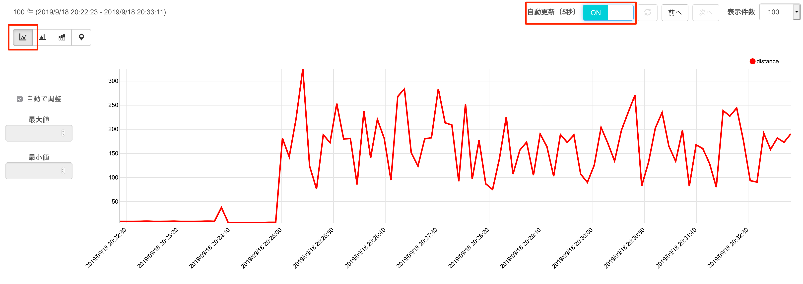

## 6 章 SORACOM Harvest Data で可視化してみる

SORACOM のサービス、Harvest Data を体験してみましょう。

### SORCOM Harvest とは

SORACOM Harvest Data (以下、Harvest) は、IoT デバイスからのデータを収集、蓄積するサービスです。

SORACOM Air が提供するモバイル通信を使って、センサーデータや位置情報等を、モバイル通信を介して容易に手間なくクラウド上の「SORACOM」プラットフォームに蓄積できます。
保存されたデータには受信時刻や SIM の ID (IMSI) が自動的に付与され、「SORACOM」のユーザーコンソール内で、グラフ化して閲覧したり、API を通じて取得することができます。なお、アップロードされたデータは、40 日間保存されます。


> 注意: SORACOM Harvest Data を使うには追加の費用がかかります。
> 書き込みリクエスト: 1 日 2000 リクエストまで、1 SIM あたり 1 日 5 円
> 1 日で 2000 回を超えると、1 リクエスト当り 0.004 円

### SORACOM Harvest Data を有効にする

SORACOM Harvest Data を使うには、SIM グループの設定で、Harvest を有効にする必要があります。

SIM グループ設定の SORACOM Harvest 設定を開き、ON にして、保存を押します。


### プログラムのダウンロード・実行

以下のコマンドで、センサーデータを Harvest へ送信するプログラムをダウンロード・実行し、センサー情報が Harvest へ届いていることを確認しましょう。

```console
$ sudo apt install -y python-pip libssl-dev
$ pip install requests
$ curl -O http://soracom-files.s3.amazonaws.com/send_to_harvest.py
$ python send_to_harvest.py
```

#### 実行例

先ほどと同様、プログラムを実行したらセンサーの前に手をかざして数値が変化することを確認してください。正常にデータが送信されたらレスポンスコードが `201` になり `<Response [201]>` と表示されます。

```
pi@raspberrypi:~ $ sudo apt-get install -y python-pip libssl-dev
pi@raspberrypi:~ $ pip install requests
:
pi@raspberrypi:~ $ curl -O http://soracom-files.s3.amazonaws.com/send_to_harvest.py
  % Total    % Received % Xferd  Average Speed   Time    Time     Time  Current
                                 Dload  Upload   Total   Spent    Left  Speed
100  2443  100  2443    0     0   3966      0 --:--:-- --:--:-- --:--:--  3972
pi@raspberrypi:~ $ python send_to_harvest.py
- 距離を計測します
距離: 15.1 cm
- データを送信します
<Response [201]>

- 距離を計測します
距離: 4.4 cm
- データを送信します
<Response [201]>
```

プログラムを終了するには `Ctrl-C` を押してください。

#### トラブルシュート

以下のようなエラーメッセージが出た場合には、設定を確認して下さい。

- `{"message":"No group ID is specified: xxxxxxxxxxxxxxx"}`: SIM がグループに所属していない。
- `{"message":"Configuration for SORACOM Harvest is not found"}`: SIM グループで Harvest を有効にしていない。

### Harvest によるデータの可視化の確認

ユーザーコンソールから、送信されたセンサーデータを確認してみましょう。SIM を選択して、操作ボタンあるいは右クリックメニューから「データを確認」を選びます。


Harvest の画面に遷移し、グラフが表示されます。



スクリプトのデフォルト設定では5秒に一度データが送信されるので、自動更新のボタンをオンにすると、グラフも自動的に更新されます。

とても簡単に可視化ができたのがおわかりいただけたと思います。グラフ左上のアイコンで種類を変更してどのように表示されるか確認してみましょう。
